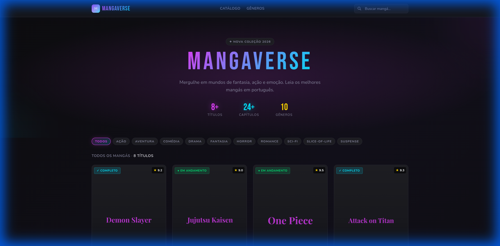
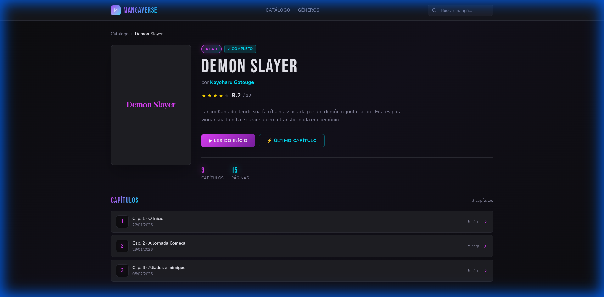
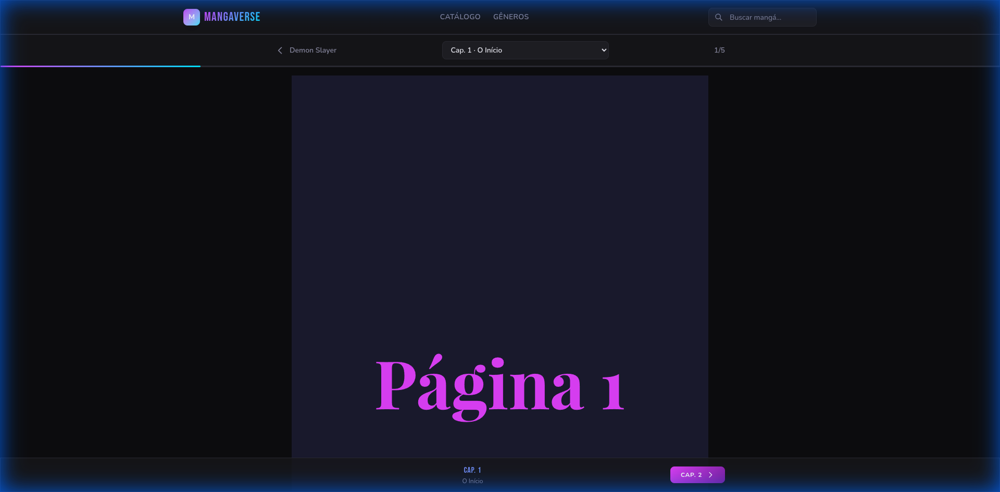
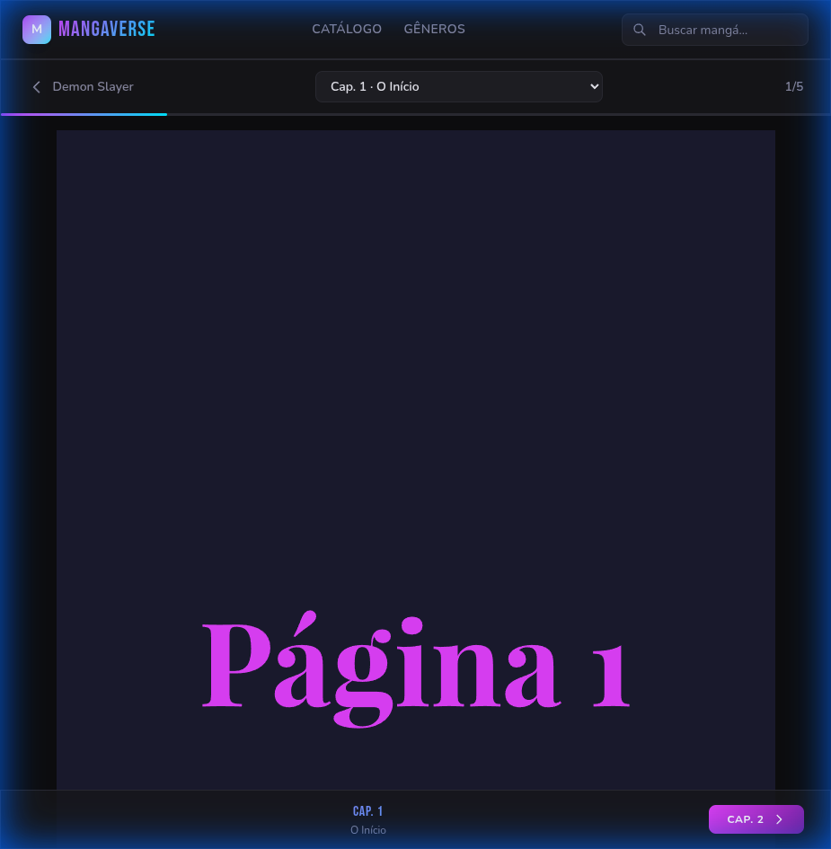

# 📚 MangaVerse

> Sua plataforma de leitura de mangás online — moderna, rápida e elegante.

MangaVerse é um leitor de mangás desenvolvido com **Ruby on Rails 8**, **Hotwire** e **Tailwind CSS**. O sistema oferece uma experiência de leitura fluida e imersiva, com um design dark fashion responsivo para celulares e desktops.

---

## 🖼️ Screenshots

| Catálogo | Detalhe do Mangá |
|:---:|:---:|
|  |  |

| Leitor de Capítulos | Mobile (375px) |
|:---:|:---:|
|  |  |

---

## ✨ Funcionalidades

- **Catálogo de mangás** com grid visual de capas, ratings e status (Em andamento / Completo / Hiatus)
- **Filtro por gênero** em tempo real via Turbo Frame (sem recarregar a página)
- **Busca** por título ou autor
- **Página de detalhe** com capa, sinopse, avaliação por estrelas e lista de capítulos
- **Leitor de capítulos** com barra de progresso dinâmica e navegação entre capítulos
- **Menu mobile** com hamburger animado
- **Design responsivo** — otimizado para celular (375px) até telas wide

---

## 🛠 Tecnologias

| Camada | Tecnologia |
|--------|-----------|
| Backend | Ruby on Rails 8.1 · SQLite |
| Frontend | Hotwire (Turbo Frames + Stimulus) |
| CSS | Tailwind CSS v4 com tema customizado |
| Fontes | Bebas Neue (títulos) · Nunito (corpo) |

---

## 🚀 Como executar

**Pré-requisitos:** Ruby 3.2+, Bundler

```bash
# 1. Instalar dependências
bundle install

# 2. Criar e migrar o banco de dados
bin/rails db:create db:migrate

# 3. Popular com dados de exemplo
bin/rails db:seed

# 4. Iniciar o servidor
bin/rails server
```

Acesse **http://localhost:3000** no seu navegador.

---

## 🎨 Design

O tema foi desenvolvido com uma paleta **dark fashion**:
- Fundo quase preto (`#0D0D0F`) para máximo conforto na leitura
- Acentos em **lilás neon** (`#E040FB`) e **ciano** (`#00E5FF`)
- Glassmorphism na navbar e leitor
- Animações suaves em hover, fade-in e progresso de leitura

---

## 📁 Estrutura principal

```
app/
├── controllers/
│   ├── mangas_controller.rb      # Catálogo e detalhe
│   └── chapters_controller.rb   # Leitor de capítulos
├── models/
│   ├── manga.rb                  # Título, autor, gênero, status
│   ├── chapter.rb                # Capítulos com navegação
│   └── page.rb                  # Páginas individuais
├── views/
│   ├── mangas/                   # Index e show
│   └── chapters/                 # Leitor
└── javascript/controllers/
    ├── navbar_controller.js      # Menu mobile
    └── reader_controller.js      # Progresso de leitura
```

---

Feito com ♥ e Ruby on Rails.
